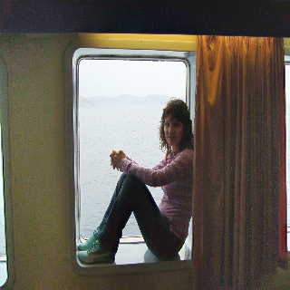
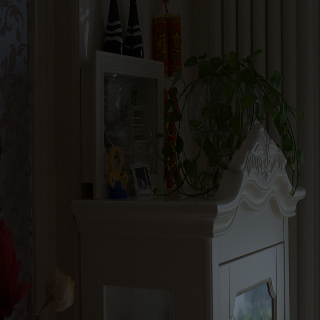

<table border="0">
  <tr>
    <td width="75%">
      <h1>Name: Xuemeng Wang</h1>
      
<b>Email: zy1902513@buaa.edu.cn</b>

      
<b>Address: BeiHang University, XueYuan Road No.37,HaiDian District,BeiJing,China</b>

    </td>
    <td width="25%">
          
    </td>
  </tr>
</table>

# Background
-2012.09-2015.07, Undergraduates, Jilin University, Electronic Information Engineering Technology
-2015.09-now, Graduatestudents, BeiHang University, Electronic Information Engineering
# Research Interests
-Artificial Intelligence
-Computer Vision
-Image Processing
-Deep Learning
# Research Projects
## Low-light image enhancement
<table border="0">
  <tr>
    <td width="50%">
      
    </td>
    <td width="50%">
            
    </td>
  </tr>
</table>

<table border="0">
  <tr>
    <td width="50%">
      
    </td>
    <td width="50%">
            
    </td>
  </tr>
</table>

<table border="0">
  <tr>
    <td width="50%">
      
    </td>
    <td width="50%">
            
    </td>
  </tr>
</table>
# Award
-2019-2021: Second-class scholarships for two consecutive years
-2020-2021: The third prize in the mathematics competition of "Huawei Cup"
